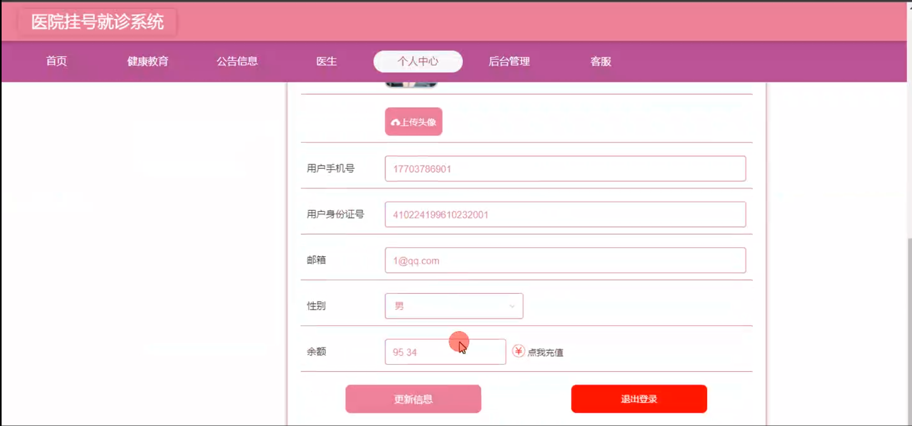
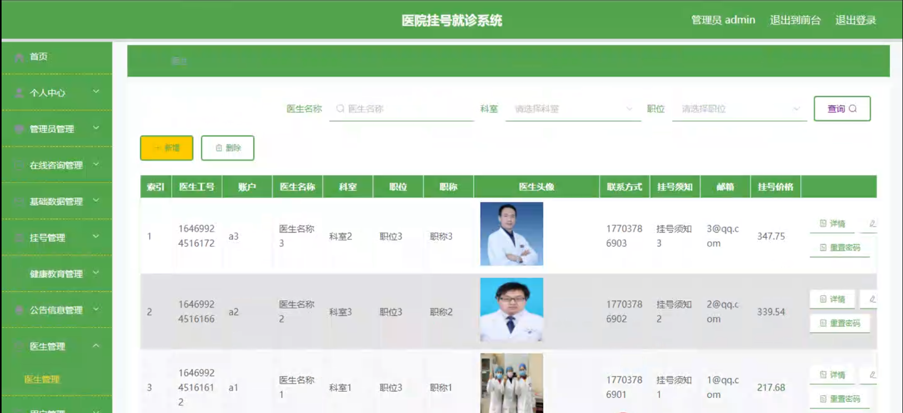

# 基于springboot的医院挂号就诊系统

---
### 👉作者QQ ：1556708905 微信：zheng0123Long (支持定制修改、部署调试、定制毕设)

### 👉接网站建设、小程序、H5、APP、各种系统等

---

#### 介绍
在医疗服务需求不断增长和数字化技术迅速发展的背景下，传统的医院挂号就诊流程面临着效率低下、患者体验不佳等问题。为了改善这一状况，提高医疗服务的质量和效率，我们开发了基于 Spring Boot 的医院挂号就诊系统。
然而，现有的一些医院挂号就诊系统仍存在诸多不足，如功能不够完善、操作不够便捷、数据安全性不足等。本系统旨在填补这些研究空白，提供一个全面、高效、安全且用户友好的解决方案。

#### 技术栈

后端技术栈：Springboot+Mysql+Maven

前端技术栈：Vue+Html+Css+Javascript+ElementUI

开发工具：Idea+Vscode+Navicate

#### 系统功能介绍

（一）管理端  
个人中心：管理端工作人员可以在个人中心查看和修改自己的个人信息，以及系统操作记录和通知。  
管理员管理：对不同级别的管理员进行添加、删除、修改操作，明确各级管理员的权限和职责。  
在线咨询管理：查看和回复患者的在线咨询，及时为患者提供帮助和建议。  
基础数据管理：维护医院的基础数据，如科室设置、疾病分类、药品信息等。  
挂号管理：负责患者挂号的统筹安排，包括号源分配、挂号时间设置、挂号费用管理等。  
健康教育管理：发布和更新健康教育内容，如疾病预防知识、康复建议、健康生活方式等。  
公告信息管理：发布医院的重要通知、就诊指南、停诊信息等公告，确保患者及时了解医院动态。  
医生管理：对医生的个人信息、资质审核、排班安排、绩效评估等进行管理。  
用户管理：管理患者的基本信息、就诊记录、账户信息等，保障患者数据的安全和准确。  
轮播图信息管理：设置医院首页的轮播图内容，展示医院特色科室、专家介绍、优惠活动等信息。  

（二）医生端  
健康教育：发布和更新与自己专业相关的健康教育内容，为患者提供更多的健康知识。  
公告信息：及时查看医院发布的公告信息，了解医院的最新动态和工作安排。  
医生模块：查看自己的排班信息、患者预约情况、诊断记录等。  
个人中心：修改个人资料、设置工作偏好、查看绩效数据等。  
后台管理  
挂号管理：查看自己的挂号患者名单，提前了解患者病情。  
健康教育管理：协助管理端审核和优化健康教育内容。  
公告信息管理：对与自己科室相关的公告信息进行补充和确认。  
客服模块：在线解答患者的疑问，提供就诊前的咨询服务。  

（三）用户端  
健康教育：学习各类健康知识，提升自我保健意识。  
公告信息：获取医院的最新通知和就诊相关信息，合理安排就诊时间。  
医生模块：查看医生的简介、擅长领域、出诊时间等，方便选择合适的医生。  
个人中心：管理个人信息、就诊历史、预约记录等。  
后台管理  
挂号管理：在线预约挂号、取消挂号、查看挂号进度。  
健康教育管理：对感兴趣的健康教育内容进行收藏和分享。  
公告信息管理：标记已读公告，方便后续查阅。  
客服模块：向客服咨询就诊流程、医保政策等问题。  

#### 系统作用

提高挂号就诊效率  
患者可以通过线上系统方便快捷地完成挂号，减少排队等待时间，提高医院的服务效率。  

优化医疗资源配置  
管理端可以根据患者需求和医生排班合理分配医疗资源，提高资源利用率。

提升医疗服务质量  
医生能够提前了解患者病情，为患者提供更精准的诊断和治疗，同时通过健康教育提高患者的健康素养。

增强医患沟通  
在线咨询和客服模块为医患之间提供了更多的沟通渠道，有助于建立良好的医患关系。

促进医院信息化管理  
实现医院数据的集中管理和分析，为医院的管理决策提供数据支持，推动医院的信息化发展。

#### 系统功能截图

代码结构

数据库表

登录

前台页面首页

个人中心

公告信息

医生模块

客服模块

用户端后台管理

挂号管理

公告信息管理

医生端健康教育管理

管理员端在线咨询管理

健康教育类型管理

医生管理

用户管理

轮播图信息管理

#### 总结

基于 Spring Boot 的医院挂号就诊系统，通过清晰的角色划分和丰富的功能模块，为医院管理、医生工作和患者就诊带来了极大的便利。该系统不仅弥补了现有医院挂号就诊系统的不足，还进一步优化了医疗服务流程，提高了医疗服务的质量和效率。然而，系统在实际应用中可能还会面临一些挑战，如网络稳定性对系统运行的影响、患者对新系统的接受程度等。未来，我们将持续关注并改进这些问题，不断完善系统功能，为医疗行业的数字化发展贡献力量。

#### 使用说明

创建数据库，执行数据库脚本 修改jdbc数据库连接参数 下载安装maven依赖jar 启动idea中的springboot项目

前台登录页面
http://localhost:8080/yiyuanguanhaojiuzhen/front/index.html

后台登录页面
http://localhost:8080/yiyuanguanhaojiuzhen/admin/dist/index.html

管理员				账户:admin 		密码：admin

医生				账户:a1 		密码：123456

用户				账户:a1 		密码：123456